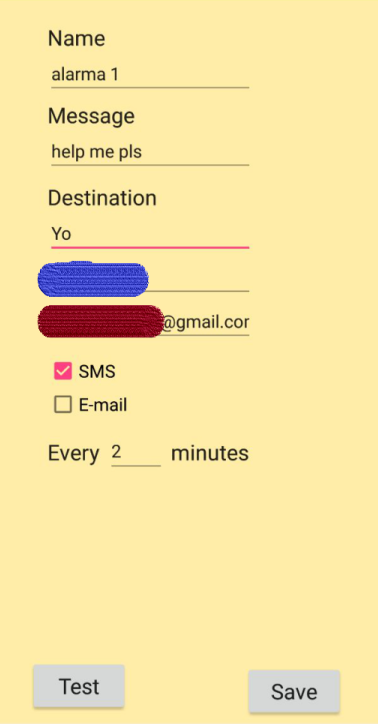
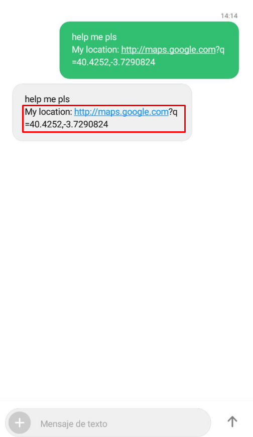

# salvavidapp

Android app to send your GPS location via SMS or email (instantly)

**DEPRECATED!** In 2017 it worked 100 % of the times and with all the mobile and Android versions tested, but in 2019 it fails with most of them.

## Screenshots

Creating the alarm:

Testing it:

Adding a widget:

It gets created:
