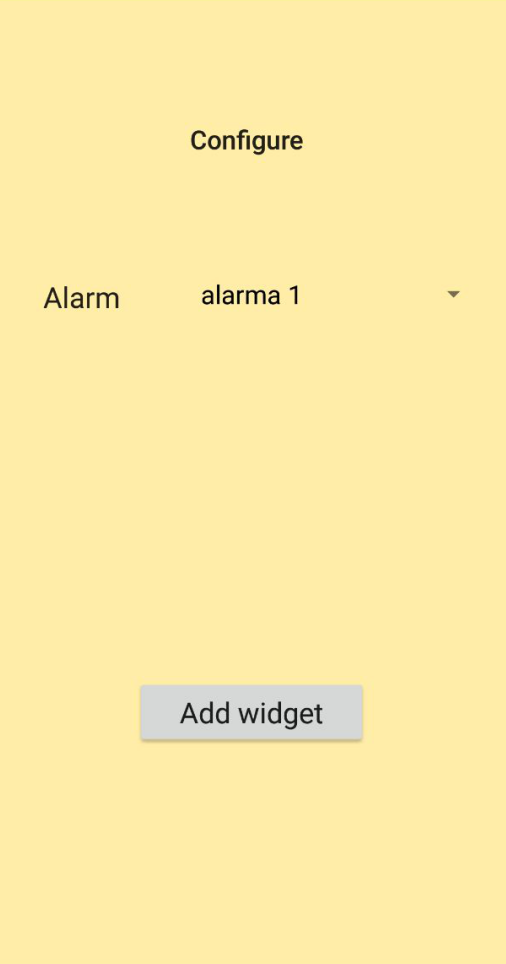
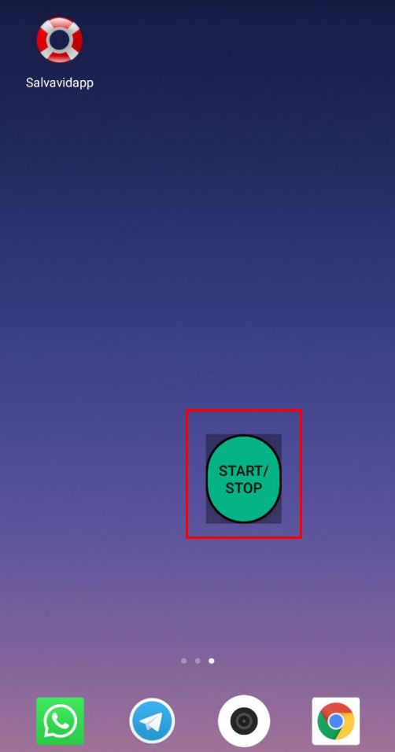

# salvavidapp

Android app to send your GPS location via SMS and/or email to whoever you want, repeating the process every a specified number of minutes.

It allows to create one widget with one of the alarms created, to start or stop the process.

------------------------------------

**DEPRECATED** In 2017 it worked 100 %, now widget and DB are not working properly

------------------------------------

You can set:

- Alarm name

- Message to send before your GPS location

- Phone Contact or Phone number

- Email

- Number of minutes between sending them

------------------------------------

## Screenshots

Creating the alarm:

Testing it:

*(Now you now where i live... or maybe not. Tested in the streets of my beautiful neighbor in Madrid :D)*

------------------------------------

## Widget functionality

Adding a widget:

It gets created:

------------------------------------

TODOS:

- Fix DB

- Fix "stop" function (or become rich, i can not send infinite SMS messages)

- Allow to create more than one widget

- Encryption would be welcomed :D (*ewqewqewqewqewq*)

- Modularize the code, after 2 years it is like chinese even for me
